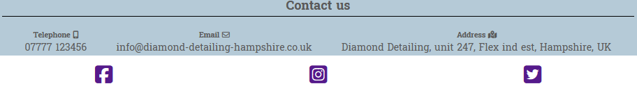

# Diamond Detailing

Diamond detailing is a site to help promote and help sell services. The site targets customers looking to have their car cleaned by a professional company. The website shows off some existing work carried out on high end cars and gives details about the work that can be undertaken. The enquiries form gives the user quick user experience to obtaining a quote.

## Existing Features

- __Navigation Bar__

    - The Navigation bar features on all 3 pages allowing the user to jump from one page to another with ease and without having to use the back button.
    - The logo is also responsive and will take the user to the home screen when clicked.

- __The landing page image__

    - The landing includes a photograph with text overlay with company name.
    - The image shows users work carried out by Diamond detailing.

- __Company values__

    - Company values section shows brief services, company promise and location.
    - This section is fully responsive between media sizes.

- __Company address and footer__

    - The company address and contact details are shown at the bottom of the page.
    - Medai links feature on all 3 pages, clicking the links will take you to the companies social media pages.

- __Services__

    - Users will see another image of work carried out by Diamond detailing.
    - Service lists appear under the image in a list format, these are full responsive between media sizes.
    - On larger screens, users will see an additional image between the service list, this uses up white space and looks visually pleasing.

- __Enquiries form__

- This page allows the user to request a quote, they are asked to fill in name, email, car details and then choose what services they require, once complete they can submit their request.

## Testing

### Validator Testing

-HTML
- No errors were returned when passing through the official
[W3C validator](https://validator.w3.org/nu/?doc=https%3A%2F%2Fsclements1981.github.io%2FDiamond-Detailing%2Fcontact-us.html)

-CSS
- No errors were found when passing through the official 
[(Jigsaw) validator](https://jigsaw.w3.org/css-validator/validator?uri=https%3A%2F%2Fsclements1981.github.io%2FDiamond-Detailing%2Fcontact-us.html&profile=css3svg&usermedium=all&warning=1&vextwarning=&lang=en)
        
### Unfixed bugs

- No bugs need to be fixed.

## Delpoyment

- This site was deployed to GitHub pages.

The live link can be found here - https://sclements1981.github.io/Diamond-Detailing/contact-us.html

## Credits

## Content

- The icons in the footer and services were taken from Font Awesome

### Media

- The images for the Home page and the oval image on the service page were taken from https://unsplash.com
- The images used for enquires page and service page were taken from https://pixabay.com

